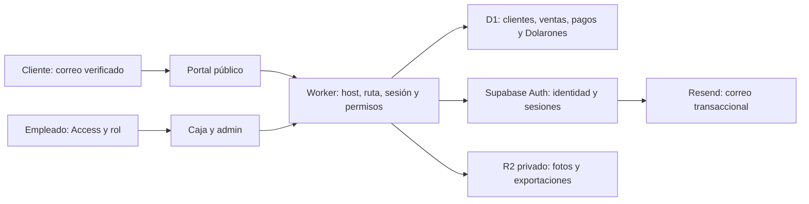

# Recompensas Dolarones — plan de implementación y lanzamiento

Fecha: 24/09/2026. Propietario: Isaac. [Issue #56](https://github.com/iskaar/El-Dolaron-Social-Kit/issues/56). Reglas: [RECOMPENSAS-DOLARONES.md](RECOMPENSAS-DOLARONES.md).

**Recomendación:** lanzar un programa pequeño y completo: registro y saldo privados en línea, QR/PIN, acumulación del 10%, canje presencial, devoluciones, regalo de apertura y operación de contingencia. Construirlo sobre la caja existente. Temporadas y gamificación llegan después. Este documento es el plan; el producto todavía no está implementado ni aprobado para producción.

**Ajuste de presupuesto solicitado el 24/09/2026:** desarrollar con Codex y Claude Code usando las suscripciones existentes; Claude Pro cuesta $20/mes. El presupuesto de servicios baja de $94–95 a **$50–51/mes**, con staging gratuito y monitor externo gratuito. Mantener autenticación administrada en producción, respaldo, revisión y pruebas de dinero. El detalle distingue gasto existente, incremento y condiciones para bajar más.

## 0. Revisión del 26/09/2026: decisiones de Isaac y alcance para el 2 de octubre

Isaac cerró las decisiones de R01 (detalle en la sección 2 de las [reglas](RECOMPENSAS-DOLARONES.md)): apertura el **2 de octubre**, uso parcial como monedero, 10 D por cada bloque completo de $100, regalo válido 30 días sin reasignación, sin retroactividad, +50/+5 apagados, 2 cajas y 4 personas, e Isaac resuelve incidencias. El calendario de la sección 5 queda reemplazado.

**Alcance para el 2 de octubre** ([Issue #81](https://github.com/iskaar/El-Dolaron-Social-Kit/issues/81)), dentro del Worker y D1 actuales, sin proveedores nuevos:

- Alta de socios **en la tienda**, hecha por personal con sesión de Access: número de socio consecutivo (define el regalo), nombre, contacto opcional, PIN y aceptación de bases.
- Saldo por lotes con vencimiento: regalo (30 días) y compras (12 meses, disponibles desde el día siguiente).
- Caja: identificar al socio, ganar Dolarones (también sin red; se acreditan al sincronizar) y pagar en parte con Dolarones (solo con red y con PIN). Venta, pagos, lotes y existencias se confirman en un solo batch.
- Cancelación atómica que regresa existencias y Dolarones.
- Ticket con socio, Dolarones usados y ganados, y saldo.

**Después de la apertura:** portal en línea con correo verificado (Supabase/Resend u otra opción, según la sección 7), consulta de saldo por el cliente, temporadas y premios. Hasta entonces no hace falta ninguna cuenta ni gasto nuevo: el costo mensual de la sección 7 se pospone.

| Confirmado por Isaac | Aplicación |
| --- | --- |
| Apertura en la primera semana de octubre de 2026 | Ventana 1–7 de octubre; fecha exacta pendiente |
| Hasta 1,000 clientes al inicio y 10,000 el primer año | Dimensionar registros, usuarios activos, compras y picos por separado |
| Registro/consulta en línea; canje en tienda | Sin carrito ni cobro en línea en v1 |
| Membresía QR/PIN y correo verificado | Sin gasto de SMS/WhatsApp para autenticación |
| 1 D = $1 MXN, acumulación 10%, cualquier producto, 12 meses | Conservar; precisar aritmética, devoluciones y disponibilidad antes de programar |
| Regalo de 15,000 D para los primeros 100 registrados | Mantener tabla de importes; publicar elegibilidad y orden; reparto de espera sin azar |
| Desarrollo con Claude y Codex; reducir gasto inicial | Usar Claude Pro existente de $20/mes; sin upgrade ni bolsa API por defecto |

Antes de activar reglas comerciales, Isaac debe decidir: día/hora de apertura y registro, +50/+5 y acumulación con el regalo, interpretación de «siguiente visita», base/redondeo, restitución después de vencimiento, manejo de cuentas duplicadas y reparto de remanentes. Las propuestas concretas están en la sección 7 del documento de reglas. También faltan presupuesto mensual, número real de cajas/tiendas y responsable de incidentes. Se presupuesta provisionalmente **una tienda, hasta dos cajas y cinco empleados**; no son datos confirmados.

No hace falta conocer el costo de cada pallet para implementar el saldo, pero sí medirlo para validar rentabilidad. Hasta entonces, no presentar el 10% como un costo demostrado de solo 3–5% de ventas.

## 2. Resultado de la revisión

Revisado el checkout local `bdf1384` (rama de bandas, PR #55) y contrastado el flujo crítico con `origin/main` en `fc51c8d`. No se consultaron datos de clientes ni se auditó la configuración viva de Cloudflare. Los siguientes son hallazgos de código/diseño, no afirmaciones de que una intrusión haya ocurrido.

| Prioridad | Evidencia | Implicación y ajuste |
| --- | --- | --- |
| P0 | `app/src/worker.ts`: `cancelarVenta` marca la venta antes del batch de reposición | Una interrupción puede dejar venta cancelada sin reponer stock. Hacer cancelación, stock, pagos y reversión de D atómicos |
| P0 | `worker.ts`: filtro exclusivo para `HOST_VENDEDOR`; resto de hosts sigue al router; identidad tomada de cabecera Access | Antes de agregar puerta pública, denegar hosts/rutas por defecto, verificar JWT de Access y roles. Comprobar `workers.dev`, previews y rutas alternativas; no asumir que el dashboard ya los bloquea |
| P0 | `app/public/caja.html`: guarda en IndexedDB, imprime y muestra cobrado antes de sincronizar | Ese flujo no sirve para canjear D. Un canje espera commit; una venta monetaria offline indica recompensa pendiente, nunca saldo confirmado |
| P0 | `registrarVenta`: ID existente devuelve éxito sin comparar payload; concurrencia puede terminar en error de unicidad | Idempotencia con huella del contenido, resultado original y recuperación de respuesta perdida; el ID no basta por sí solo |
| P0 | `ventas.forma_pago` admite solo efectivo/tarjeta; no hay clientes ni ledger | Agregar pagos con importes y cliente nullable; actualizar corte, CSV, tickets, devoluciones y todos los consumidores |
| P1 | Fecha de venta proviene del cliente; cortes usan fecha UTC por substring | Rewards y bonos usan reloj del servidor y día del negocio; definir política para ventas offline. No otorgar beneficios de apertura por reloj manipulado |
| P1 | `semana_ingreso` guarda `S37`, sin año | No calcular 3/6 semanas cruzando año con esa etiqueta. Usar fecha real de ingreso o semana+año antes de automatizar rebajas |
| P1 | `.github/workflows/validate.yml` solo valida assets | Incorporar typecheck, pruebas de app e integración de dinero/autorización a CI antes del lanzamiento |
| P1 | La propuesta mezcla saldos, ranking, alta, regalo y visitas | Separar saldo gastable de puntaje; +50/+5 quedan propuestos; no dar al regalo ventaja en ranking |
| P1 | Pasos de premios prometen pases ilimitados, con cinco por descarga; presupuesto $3,000 vs TV $5,000 | Definir cupos/budget antes de desarrollar temporada. No publicar esos premios en apertura |
| P1 | TV a 5,000 D tarda 167 semanas a 30 D/semana, pero saldo vence a los 12 meses; 250 puntos requieren nueve compras de 30 | Corregir alcanzabilidad: ~1,560 D disponibles a ese ritmo; ocho compras semanales dan 240 puntos, no 250 |
| P1 | Afirmaciones generales de legalidad/costo en la propuesta | Corregidas: fuentes federales primarias, revisión profesional, crédito futuro ≠ descuento inmediato |
| P2 | `README.md`/`ARCHITECTURE.md` todavía describen solo el kit social | Actualizar mapa y límites al entregar la aplicación pública; esta revisión no reescribe la documentación del escáner |

El inventario por bandas del PR #55 no está incorporado a `main` en la base revisada. Resolver su integración y migración 008 antes de numerar migraciones de recompensas. No asumir que un esquema local equivale al esquema de producción. [Issue #32](https://github.com/iskaar/El-Dolaron-Social-Kit/issues/32) mantiene pendiente la validación física del ticket/cajón: incluir D en esa prueba, sin duplicar trabajo de impresoras.

## 3. Arquitectura propuesta

Reutilizar TypeScript, HTML/JS, Cloudflare Workers, D1 y R2. Un despliegue de aplicación por ambiente, host público nuevo y hosts internos existentes. `run_worker_first` sigue habilitado y **cada host tiene lista explícita de rutas/métodos**, incluidos HTML y assets. Los hosts desconocidos se rechazan; no existe un «todo lo demás es admin». Deshabilitar acceso público alternativo por `workers.dev`/preview o aplicar exactamente la misma protección. Verificar los tokens de Access con emisor/audiencia/expiración y asignar permisos por identidad validada, nunca por una cabecera de correo sin verificar.

**Auth administrada:** Supabase solo gestiona identidad, correo y sesiones. D1 conserva el único saldo e inventario; no copiar el ledger a Postgres. Resend actúa como SMTP de Auth. Usar SDK oficial/middleware verificado para identidad cuando resuelva validación/rotación de claves; no implementar criptografía JWT a mano. Una dependencia de seguridad pequeña y justificada es preferible a un protocolo de autenticación casero.

Flujo web: correo → OTP → verificar → crear/vincular miembro → mostrar saldo e historial. El Worker valida al usuario y obtiene su `sub` del proveedor, lo enlaza a `cliente_id` y deriva el propietario en el servidor. Un `cliente_id` aportado por el navegador nunca concede acceso. Sesiones por cookies `Secure`, `HttpOnly`, `SameSite`, con protección CSRF/origin, expiración, renovación y logout/revocación probados. Respuestas privadas `no-store`; sin tokens en URLs, registros o almacenamiento persistente del frontend.

Membresía presencial: QR aleatorio revocable más PIN elegido por el cliente, con hash lento y sal, intentos limitados de forma atómica. El cliente introduce el PIN sin que lo vea la cajera. Un QR fotografiado o conocer un teléfono no basta para gastar. Recuperación con correo verificado y comprobación adicional cuando haya membresía previa; sin correo, recuperación manual por gerente con evidencia/auditoría. Evitar fusiones automáticas por teléfono: números compartidos/reciclados son normales.

**Aislamiento de pruebas:** Worker/D1/R2 y proyecto Auth distintos para staging y producción. Solo datos sintéticos en staging. Revisar permisos de cuentas proveedoras, MFA del personal, secretos y revocación. No mover al público la cámara, análisis de fotos, reportes, exportaciones ni APIs administrativas.

Para ahorrar, el proyecto Auth de staging vive en una **organización Supabase Free separada**, dentro de los dos proyectos gratuitos permitidos. Puede pausarse por inactividad: reactivarlo y repetir smoke tests antes de cada entrega. Producción conserva Pro. No compartir clientes, cookies, llaves ni proyecto Auth entre ambientes para ahorrar $10. Supabase permite combinar organizaciones pagadas y gratuitas: [regla de facturación](https://supabase.com/docs/guides/troubleshooting/keeping-free-projects-after-pro-upgrade-Kf9Xm2).

### Modelo mínimo de datos y operaciones

| Elemento | Función y restricciones |
| --- | --- |
| `clientes` | ID estable, auth subject único nullable, contacto mínimo, estado y fechas; correo validado por el proveedor. Alta presencial puede no tener correo |
| `consentimientos` | Finalidad, versión, aceptación/retiro y fecha; sin preseleccionar marketing |
| Credencial de membresía | Identificador aleatorio, hash PIN, versión/revocación, contador/bloqueo de intentos; no exportar hashes a la caja |
| `ventas.cliente_id` | Nullable para conservar venta anónima; ventas previas no se adjudican por coincidencia de teléfono |
| `venta_pagos` | Efectivo/tarjeta/D y centavos aplicados; no confundir efectivo recibido con aplicado. Migrar datos históricos sin cambiar totales |
| Ledger de D | Asientos inmutables: ID, cliente, causa, importe entero, lote/origen, venta/devolución, autor, fecha y versión de reglas; unicidad por evento de negocio |
| Lotes y aplicaciones | Disponibilidad/vencimiento y asignaciones a canjes; proyección de remanente actualizada en la misma transacción, reconstruible desde ledger |
| Devoluciones | ID único, líneas/cantidades y reparto monetario/D/ganancia; impedir devolver más de lo comprado o repetir reposición |
| Apertura | Campaña, secuencia de registro, 100 asignaciones, lista privada de espera, linaje de remanentes, estado y presupuesto; una asignación activa por miembro |
| Operaciones idempotentes | ID+huella canónica+resultado; misma operación no se vuelve a gastar ni acreditar. Ajustes requieren motivo y rol |

Una sola función de dominio ejecuta cada operación monetaria completa. En D1, `batch()` tiene comportamiento transaccional si una sentencia falla; **una actualización condicional que afecta cero filas no es un error por sí sola**. Diseñar restricciones/triggers que aborten explícitamente al faltar saldo/stock/cupo y probarlas contra D1. No hacer «leer saldo, decidir en JavaScript, escribir después». Tampoco usar `waitUntil` para persistir dinero después de responder. Fuente: [D1 batch](https://developers.cloudflare.com/d1/worker-api/d1-database/).

Usar importes seguros enteros, validación de entrada y límites de payload/líneas. El cliente manda productos/cantidades/importe D deseado; el servidor calcula precios, elegibilidad, total, autorización y saldo. Limitar consultas por cliente/campaña/fecha con índices, paginar historial y exportaciones, y no leer el ledger entero para cada saldo. Probar el orden de escritura bajo concurrencia, no confiar en cachés o en una réplica para autorizar canjes.

## 4. Trabajo por agente, modelo y esfuerzo

Los nombres siguientes son **roles de ejecución**, no nuevos empleados ni agentes ya iniciados. Se recomienda asignarlos a tareas separadas con sus propios criterios de aceptación. El revisor recibe código y evidencia con contexto independiente. Ningún modelo sustituye aprobación comercial, revisión legal o prueba en la tienda.

**Agrupación recomendada, dos modelos y dos herramientas:** `Codex / Sol high → Claude Code / Sonnet medium → Claude Code / Sonnet high → Codex / Sol high`. Solo dos cambios entre herramientas/modelos; Claude sube esfuerzo una vez para revisar. Cada uno recibe un bloque completo, sin intercambiar archivos a cada paso. Se reutiliza esta revisión como punto de partida, sin pagar otra investigación general. Agrupar por modelo no altera dependencias. No usar `max`, `ultra`, Opus, Fable o Astra por defecto.

| Lote | Agente / responsabilidad | Modelo exacto | Esfuerzo | Actividades agrupadas | Depende de | Evidencia de salida |
| --- | --- | --- | --- | --- | --- | --- |
| A | A01 Codex: arquitectura y reglas | `gpt-6-sol` | `high` | R01: cerrar decisiones del plan, datos, API y ejemplos de aceptación | Respuestas de Isaac | Contrato aprobado; issues implementables |
| B | A02 Codex: backend, identidad y dinero | `gpt-6-sol` | `high` | R02–R05: migraciones, Auth/permisos/PIN, ledger, ventas/refunds, apertura/folios | A | Integración verde y prueba atómica de flujos críticos |
| C | A03 Claude Code: portal y caja | `claude-sonnet-5` | `medium` | R06: pantallas, ticket, acceso y recuperación; consumir API definida | B | Recorrido móvil/caja, accesibilidad y errores probados |
| C | A04 Claude Code: operación y entrega | `claude-sonnet-5` | `medium` | R07: CI, staging, alertas, scripts de restauración y ensayo | B; integrar C | Restauración reproducible y evidencia del piloto |
| C | A05 Claude Code: contenido y capacitación | `claude-sonnet-5` | `medium` | R08: textos aprobados, instrucciones de caja/papel/soporte y docs | A; capturas finales de C | Guía que otro empleado puede seguir |
| D | A06 Claude Code: revisión del backend de Codex | `claude-sonnet-5` | `high` | R09: revisar seguridad, concurrencia, devoluciones y presupuesto con contexto nuevo | B y C completos | Casos reproducibles y hallazgos; sin aprobar su propio frontend |
| E | A07 Codex: revisión del trabajo de Claude e integración | `gpt-6-sol` | `high` | R09: revisar portal/CI/operación; integrar y corregir backend; repetir pruebas afectadas | D | Sin defectos críticos/altos; revisión cruzada completa e Isaac aprueba salida |

Sol y Sonnet cubren el trabajo normal; un modelo más caro solo se considera ante un bloqueo concreto o hallazgo difícil, con presupuesto antes de generar cargos nuevos. Las correcciones críticas reciben una nueva revisión del otro agente: agrupar trabajo no elimina ese regreso necesario. La revisión cruzada reduce puntos ciegos, pero no garantiza seguridad. Fuentes: [modelos Codex](https://learn.chatgpt.com/docs/models), [modelos Claude](https://platform.claude.com/docs/en/models/overview) y [esfuerzo Claude](https://platform.claude.com/docs/en/build-with-claude/effort). Sonnet 5 admite `medium` como ajuste de menor consumo frente a su `high` predeterminado; conservar `high` para revisar dinero/autorización.

Trabajar con una sesión activa por herramienta, tareas acotadas y handoff con commit, archivos/API y pruebas; no pedir dos implementaciones completas del mismo problema. Confirmar disponibilidad de los modelos en las cuentas antes de iniciar. Si se alcanza el límite de Pro/Codex, pausar ese bloque hasta el reinicio o continuar trabajo independiente con la otra suscripción; no activar sobreconsumo ni API automáticamente. Los límites pueden ampliar el calendario, no reducen los criterios de salida.

Cada issue debe contener alcance, archivos dueños, dependencias, ejemplos de aceptación y evidencia. Cada entrega: commit, pruebas ejecutadas, resultados, pendientes y decisiones; no usar memoria privada como contrato. Seguir `AGENTS.md`: issue, rama `agent/<agente>/<issue>-<slug>`, PR y CI. Un agente integra cambios en `worker.ts`/migraciones para evitar ediciones competidoras. Se pueden hacer contenidos y preparativos de operación mientras madura la API, pero el flujo crítico queda secuencial.

### Backlog listo para convertir en Issues

| ID | Entregable mínimo | Archivos/áreas esperadas | Aceptación específica |
| --- | --- | --- | --- |
| R01 | Reglas aprobadas y ejemplos de dinero | Documentos de reglas y plan; contrato de API en el issue | Isaac resuelve pendientes comerciales; contador/asesor revisan bases, datos y fiscalidad; no se programa ambigüedad |
| R02 | Esquema incremental y ledger | Nueva migración tras la última integrada, `schema.sql` para instalación limpia, módulo de recompensas y pruebas | Migrar copia de base existente; mismos totales/stock históricos; restricciones y unicidad; instalación limpia y upgrade dan esquema equivalente |
| R03 | Identidad, sesiones, PIN, roles y protección de host | Worker/router, configuración por ambiente, Auth/SMTP, middleware y pruebas | Cliente A no ve B; QR solo no canjea; vendedor no ve caja; cabecera falsificada no autentica; tokens vencidos y host alternativo fallan cerrados |
| R04 | Venta/pagos/cancelación/devolución atómicos | `worker.ts`, `venta.js`, `caja.html`, ticket/reportes/exportación, pruebas D1 | $250 pagado $200 monetarios+50 D gana 20 D según regla propuesta; retry/concurrencia/caída/refund no duplican nada; corte coincide con medios |
| R05 | Apertura, expiración y papel | Recompensas, tablas de campaña/folios, admin restringido, tarea programada | 100 asignaciones suman 15,000 D; #101 espera; cierre parcial y repetido conserva límite y orden; papel nunca duplica saldo digital |
| R06 | Experiencia cliente y cajera | Portal público nuevo, caja y ticket existentes | Correo→registro→QR/PIN→compra→saldo→canje→devolución; accesible en móvil/teclado; todos los errores tienen salida y soporte |
| R07 | Operación reproducible | CI app, configuración staging/prod, guía backup/rollback, monitor | Despliegue limpio, migración ensayo, restauración y reimportación controlada; alerta real recibida; caja física validada |
| R08 | Bases y capacitación | Aviso y bases aprobados; instrucciones, preguntas frecuentes y docs | No fechas/montos pendientes en texto publicable; empleado resuelve caída, olvido PIN y devolución siguiendo guía |
| R09 | Auditoría de entrega y piloto | Resultados de pruebas en PR, informe de piloto | Puertas de lanzamiento de sección 6 cumplidas; Isaac aprueba fecha/activación |

No crear todos los issues especulativos ahora: convertir R01–R09 al iniciar implementación y enlazarlos al seguimiento. Este PR contiene únicamente los dos documentos de planificación.

## 5. Calendario para octubre

Hay 7–13 días calendario desde esta revisión hasta la ventana de apertura. Estimación orientativa: **50–80 horas de ingeniería/revisión**, más decisiones, asesoría, alta de proveedores y pruebas físicas. No es una cotización ni una promesa de que un agente termine en ese plazo. Si la apertura es el 1 de octubre, el margen es especialmente pequeño.

Distribución de esa estimación: lote A 4–6 h, B 24–36 h, C 14–24 h y D+E 8–14 h. Son horas de trabajo supervisado, no tiempo de generación del modelo; defectos nuevos, límites de suscripción o demoras externas pueden ampliar el calendario.

| Fecha objetivo | Trabajo | Condición para seguir |
| --- | --- | --- |
| 24–25 sep | Lote A, cuentas/dominio de correo, reglas, integrar dependencias de caja | Fecha y reglas publicables; SMTP y ambientes accesibles |
| 25–28 sep | Lote B, primero una venta completa en staging y luego todos los casos de fallo | Ledger/refunds/Auth pasan integración; ninguna diferencia monetaria |
| 28–30 sep | Lote C, portal/caja, alertas, restauración y ensayo con 10–20 miembros de prueba | Datos sintéticos; impresión/PIN/conexión real probados; guías listas |
| 30 sep–2 oct | Lotes D+E, correcciones, piloto supervisado y cierre de hallazgos | Revisión cruzada e Isaac aprueban evidencia; sin defectos críticos/altos |
| 1–7 oct, día confirmado | Activar solo una versión aprobada, monitorear cada jornada | Para abrir el día 1, todo lo anterior debe terminar el 30; de lo contrario, papel controlado |
| Días 2–14 de operación | Conciliación diaria, revisión de soporte, uso y costos | Resolver diferencias el mismo día; extender despliegue solo con evidencia |
| Después de 2–4 semanas estables | Diseñar vitrina, temporadas, visitas/referidos si se aprueban | Presupuesto/margen/cupos revisados; reglas y premios publicados antes de temporada |

**Si el software no llega al corte de 48 horas antes del día confirmado**, dejar el canje digital desactivado y usar el procedimiento presencial numerado aprobado. Un formulario público tampoco sale sin privacidad/autenticación probadas. No improvisar una planilla pública ni una billetera offline. El respaldo de papel requiere entrenamiento, custodio, conciliación e importación por folio; no es ausencia de controles. Una promoción ya anunciada debe respetarse: preparar el respaldo antes de anunciarla.

## 6. Criterios verificables de producción

Estos controles son trabajo pendiente, no casillas ya aprobadas por esta revisión documental.

### Dinero y operación

- [ ] Prueba de 100 altas elegibles: asignaciones `1×500 + 10×300 + 13×200 + 26×150 + 50×100 = 15,000`; alta 101 en espera; altas simultáneas nunca comparten lugar.
- [ ] Repetir una venta/canje 20 veces con el mismo ID devuelve el mismo resultado. El mismo ID con importe/cliente distinto falla sin mutar datos.
- [ ] Dos cajas intentan gastar 80 D de una cuenta con 100 D al mismo tiempo: exactamente una confirma; saldo final 20 D. Probar también última pieza y último lugar promocional.
- [ ] Inyectar fallo antes/durante/después del batch y perder la respuesta HTTP: nunca ticket, pago, stock o saldo a medias. Retry recupera estado confirmado.
- [ ] Cubrir $0.01, $99, $250, cantidades máximas, pago total en D, mixto, cambio, cancelación total y devolución parcial repetida. Revertir D ya gastados sin inventar efectivo.
- [ ] Venta monetaria offline con precio/stock cambiado al sincronizar: conservar importe efectivamente cobrado y ticket original, enviar a resolución visible del gerente; no recobrar ni recalcular silenciosamente. No acreditar D hasta resolverla.
- [ ] Vencimiento por lote, año bisiesto, cierre de día local, compra offline enviada tarde, cron caído y reloj del cliente alterado. Ningún saldo vencido se gasta.
- [ ] Regalo parcialmente usado, cierre día 1, reasignación repetida, vencimiento día 2 y devolución posterior: conserva linaje y presupuesto autorizado.
- [ ] Papel vs digital, pérdida de vale, folio repetido, importación repetida y conciliación de corte; cada peso/D queda explicado.

### Acceso, privacidad y experiencia

- [ ] Probar acceso cruzado por todas las rutas de cliente, no solo la página de saldo; vendedor/cajera/gerente tienen permisos diferentes.
- [ ] Probar hosts alternativos, assets privados, API sin Access, cabeceras falsificadas, tokens revocados/vencidos, CORS/CSRF y salida HTML con alias/texto malicioso. Sin PII en logs, URLs, métricas o errores.
- [ ] QR copiado no permite gastar; PIN bloquea intentos distribuidos por cuenta; recuperación no depende de conocer teléfono/nombre. Empleado no puede regalarse saldo sin huella.
- [ ] Turnstile validado en servidor con hostname/action; protección también en proveedor Auth para evitar saltarse el Worker y bombardear correo directamente. Límites por cuenta y origen, cooldown y presupuesto de envíos.
- [ ] Resend SPF/DKIM/DMARC y SMTP comprobados con Gmail y Outlook; entregar/verificar correo, retry controlado, rebotes y dirección inválida. Elevar límites de Auth para apertura sin quitar protección por usuario.
- [ ] Aviso/bases accesibles antes del registro, marketing opcional y retiro funcional; atención ARCO y recuperación con responsable asignado.
- [ ] Android e iPhone, teclado/lector de pantalla, contraste, carga lenta y pantalla pequeña; QR/PIN sin cámara como alternativa asistida. Ticket legible y reimpresión sin repetir venta.

### Rendimiento, recuperación y salida

- [ ] Dataset sintético de 10,000 miembros y 500,000 movimientos; paginación e índices verificados. Prueba propuesta de 30 minutos con 50 sesiones, 10 solicitudes/s y ráfaga de 30/s por 5 minutos, más 1,000 altas en una hora. Ajustar si se prevé un pico mayor.
- [ ] Objetivos internos: lectura de saldo p95 <1 s, commit de canje p95 <2 s bajo esa carga (sin tiempo humano de correo), <1% errores inesperados y **cero diferencias de saldo/stock**. Son criterios a medir, no capacidad ya demostrada.
- [ ] Monitor externo comprueba portal y dependencia de base; alerta llega al responsable. Registrar error rate, latencia, rechazos, fallos SMTP, falta de cron y diferencias de conciliación; sin grabar sesiones de clientes.
- [ ] Con UptimeRobot Free, comprobar portal y endpoint de salud sin datos personales cada 5 minutos, más heartbeat del respaldo/cron. Probar alerta y recuperación por correo. Ese intervalo puede tardar hasta un ciclo más el procesamiento en detectar una caída; el operador atiende fallos de caja al ocurrir, sin esperar al monitor. No prometer paging por teléfono ni detección de segundos.
- [ ] Objetivo inicial de recuperación: RTO ≤4 h durante horario atendido; RPO objetivo ≤5 min para incidente recuperable con D1 Time Travel. Probarlo, no tratarlo como SLA del proveedor. Para pérdida de cuenta, exportación diaria separada implica hasta 24 h; conservar tickets para reconstrucción.
- [ ] Ensayar restauración de exportación en base aislada. Time Travel restaura la base existente, no crea un clon; para el ensayo usar una D1 de prueba y luego verificar ventas/saldos. En incidente real congelar escrituras, preservar tickets/cola, restaurar y conciliar antes de reabrir.
- [ ] Cuenta de respaldo/copia cifrada fuera del alcance de la credencial de despliegue, retención aprobada, accesos MFA y recuperación de cuentas proveedoras. Reconciliar también vínculo Auth↔D1: un backup de D1 solo no restaura identidades.
- [ ] Migraciones aditivas y rollback de versión compatible; no deshacer migraciones destruyendo datos. No usar `schema.sql` como migración repetida de producción.
- [ ] CI verde: validador de assets, typecheck y pruebas Node existentes más integración D1 y recorridos de negocio. Usar Node/runner existente; añadir herramienta de navegador solo si aporta una comprobación que falta.
- [ ] Desplegar primero staging, después versión aprobada con funciones apagadas; verificar rutas/permisos y activar por separado registro, regalo, acumulación y canje. Interruptor de canje deja disponibles soporte/consulta; debe respetar obligaciones anunciadas.
- [ ] Isaac y operador completan una jornada piloto y firman la salida. Revisión de seguridad sin hallazgos críticos/altos y sin riesgos monetarios sin resolver.

[D1 Time Travel](https://developers.cloudflare.com/d1/reference/time-travel/) ofrece ventana de 30 días en Paid. Su existencia no sustituye ensayo, exportación ni conciliación de operaciones posteriores al punto restaurado.

## 7. Herramientas y precios

Consultados el **24/09/2026**, en **USD antes de impuestos**, salvo Dolarones/MXN expresamente indicados. No son una cotización contratada. Verificar tarifas, moneda de cobro y cuotas de la cuenta antes de comprar. No aplicar un tipo de cambio MXN inventado. Infraestructura compartida ya pagada reduce costo incremental; sus cuotas también se comparten con el escáner y otras aplicaciones.

### Operación mensual de arranque con presupuesto reducido

| Herramienta | Uso | 1,000 registrados | 10,000 registrados | Precio/límite y fuente |
| --- | --- | ---: | ---: | --- |
| Cloudflare Workers Paid | Aplicación, API, tareas periódicas; prod+staging | $5 | $5 | Mínimo por cuenta; 10 M requests y 30 M CPU-ms/mes. Exceso $0.30/M requests y $0.02/M CPU-ms. [Tarifa](https://developers.cloudflare.com/workers/platform/pricing/) |
| D1 | Ventas, ledger y campañas | $0 adicional previsto | $0 adicional previsto | Paid incluye 25,000 M filas leídas/mes, 50 M escritas/mes, 5 GB; excesos $0.001/M, $1/M y $0.75/GB-mes. [Tarifa](https://developers.cloudflare.com/d1/platform/pricing/) |
| R2 Standard | Fotos existentes y exportaciones privadas | $0–1 | $0–1 | 10 GB-mes, 1 M operaciones A y 10 M B sin cargo; luego $0.015/GB-mes, $4.50/M A, $0.36/M B; egress gratuito. [Tarifa](https://developers.cloudflare.com/r2/pricing/) |
| Cloudflare Access | Solo empleados, nunca los 10,000 clientes | $0 | $0 | Free hasta 50 usuarios; confirmar total de empleados en la cuenta. [Planes](https://www.cloudflare.com/plans/) |
| Cloudflare Turnstile | Abuso de registro/login/recuperación | $0 | $0 | Free incluye uso de producción y desafíos ilimitados; hasta 20 widgets. [Planes](https://developers.cloudflare.com/turnstile/plans/) |
| Supabase Auth Pro | Correo verificado y sesiones administradas | $25 | $25 | 100,000 MAU incluidos; $0.00325 por MAU adicional. Primera instancia Micro cubierta por crédito incluido. [Tarifa](https://supabase.com/pricing) |
| Supabase Free, organización separada | Auth de staging aislada | $0 | $0 | Usar uno de los dos proyectos gratuitos disponibles. Puede pausarse tras inactividad; reactivar antes del ensayo. Si no queda cupo, cotizar Micro $10/mes. [Regla oficial](https://supabase.com/docs/guides/troubleshooting/keeping-free-projects-after-pro-upgrade-Kf9Xm2) |
| Resend Pro transaccional | OTP, recuperación y avisos esenciales | $20 | $20 | 50,000 correos/mes, sin tope diario; excedente $0.90/1,000. Free limita a 100/día, insuficiente para apertura. [Tarifa](https://resend.com/pricing) |
| UptimeRobot Free | Monitoreo externo, alertas y página de estado básica | $0 | $0 | 50 monitores, intervalos de 5 min; uso comercial permitido, sujeto a uso razonable. [Plan y condiciones](https://help.uptimerobot.com/en/articles/11604710-who-should-use-uptimerobot-s-free-plan) |
| GitHub Free + Actions | Repo público actual, issues, PR, CI | $0 previsto | $0 previsto | Dentro de uso permitido de runners estándar para repo público. Si se privatiza o cambia plan, recalcular; Team se anuncia a $4/usuario/mes. [Planes](https://github.com/pricing) |
| HTML/JS, TypeScript, Node, Python, Wrangler | Desarrollo, validación y despliegue | $0 licencia | $0 licencia | Reutilizar herramientas y pruebas del repo; no nueva plataforma de frontend |
| Dominio existente y HTTPS | Subdominio de clientes + correo | $0 incremental previsto | $0 incremental previsto | Reutilizar `viste.com.mx`; renovación existente no auditada. Un dominio nuevo tendría tarifa propia |
| **Subtotal previsto** | **Con staging y monitor externo gratuitos** | **$50–51/mes** | **$50–51/mes** | Sujeto al volumen supuesto, cupo Free de staging y cuotas compartidas |

Reservar **$55–60/mes para la aplicación**, equivalente a **$660–720/año** como presupuesto, no tarifa garantizada. El subtotal de $50–51 equivale a $600–612/año. Se eliminan $34 de monitor pagado y $10 de staging pagado: **$44/mes o $528/año menos**, aproximadamente 47% del subtotal anterior. No se elimina staging ni vigilancia; se aceptan la pausa de pruebas y el intervalo de monitor de 5 minutos.

Mantener Workers Paid y Supabase Pro para producción: por ahora no construir autenticación propia ni depender de un proyecto Free que se pueda pausar frente al cliente. Mantener Resend Pro durante apertura por el pico de verificaciones. La reducción conserva backups, conciliación, privacidad, revisión cruzada y pruebas de dinero. No contratar soporte Enterprise, IP dedicada, Redis, Vercel, colas, Kubernetes ni app móvil para este alcance.

El total **aplicación + Claude Pro existente** sería $70–71/mes (presupuesto $75–80), **más el plan Codex ya existente cuyo precio no se ha confirmado**, impuestos y costos separados al final. Claude no agrega otros $20 si ya se está pagando. Si Workers Paid ya está cubierto por el escáner, el incremento de la aplicación sería $45–46, sujeto al consumo compartido. No se contratan ni cambian planes mediante este documento.

### Cuándo gastar menos o subir de plan

| Decisión | Condición medible | Efecto |
| --- | --- | --- |
| Bajar Resend a Free después de apertura | Al menos 30 días medidos ≤2,400 correos/mes y ≤80/día, crecimiento previsto compatible con 3,000/mes y 100/día, responsable vigila y puede subir antes de la cuota | Ahorro $20; app $30–31/mes. No es el escenario presupuestado de 5,000/30,000 correos, ni sirve para un pico de 1,000 altas |
| Mantener/subir correo | Previsión de superar esos umbrales o campaña/registro masivo | Mantener Pro $20; verificar cuotas antes de anunciar; no bloquear acceso por ahorro |
| Pagar staging | Sin cupo Free o pausas que retrasan entregas de forma repetida | +$10/mes por Micro adicional; presupuesto app $60–61 antes de margen |
| Pagar monitoreo | Se necesitan alertas más rápidas que 5 min, teléfono o varios operadores | Cotizar al necesitarlo; no requisito inicial para una tienda atendida |
| Ampliar IA de desarrollo | Límites medidos impiden cumplir una fecha y no basta reordenar tareas | Presentar costo/beneficio y pedir autorización de nuevo gasto; no contratar Max por anticipado |

La bajada de Resend exige previsión y alertas, no esperar a que se rechace un correo. No crear múltiples cuentas para repartir el envío entre límites gratuitos. [Cuotas y precios Resend](https://resend.com/pricing).

**Alta y envío:** el correo por defecto de Supabase no sirve para este lanzamiento: tiene restricciones de destinatarios y 2 correos/hora. Configurar SMTP propio; al configurarlo puede quedar un límite inicial de 30/h. La apertura propuesta necesita al menos 1,000 verificaciones/h más reintentos autorizados, sin levantar cooldown por usuario. Comprobar límites del proveedor y envío efectivo antes de publicidad. Fuentes: [SMTP](https://supabase.com/docs/guides/auth/auth-smtp), [límites Auth](https://supabase.com/docs/guides/auth/rate-limits).

### Supuestos de carga que sustentan el costo

| Medida por mes salvo indicación | Inicio | Escenario año 1 |
| --- | ---: | ---: |
| Miembros registrados acumulados | 1,000 | 10,000 |
| Miembros activos mensuales asumidos (50%) | 500 | 5,000 |
| Compras por activo | 4 | 4 |
| Compras de miembros | 2,000 | 20,000 |
| Invocaciones Worker presupuestadas, incluidos assets que pasan por Worker | 100,000 | 1,000,000 |
| CPU media supuesta | 7 ms | 7 ms |
| CPU total estimada | 0.7 M ms | 7 M ms |
| Filas leídas, con índices y paginación | 5 M | 50 M |
| Filas escritas, incluidos índices/ledger y margen | 0.1 M | 1 M |
| Correos transaccionales con margen | 5,000 | 30,000 |
| Base D1 estimada | <1 GB | <5 GB total de cuenta |
| R2 estimado (fotos + backups retenidos) | ≤50 GB-mes | ≤50 GB-mes |

Son hipótesis de diseño, no métricas medidas. Número de clientes no predice análisis de fotos ni emails por sí solo. Si los 10,000 son activos mensuales, duplicar consumo dinámico de referencia; 60,000 emails añadirían aproximadamente $9/mes. Revisar uso semanal, alertar al 50/75/90% de cuotas y cuando la proyección de servicios supere $60/mes; la alerta no es un tope duro. Limitar CPU, envíos, tamaño de peticiones y llamadas pagadas desde la aplicación. Nunca apagar silenciosamente canjes ya prometidos para ahorrar una factura.

### IA de desarrollo: separada del costo por cliente

Los clientes no usan OpenAI ni Claude para consultar/ganar/canjear D. **Costo de IA de recompensas en producción: $0 por cliente.** Los agentes se usan durante desarrollo y mantenimiento.

**Ruta elegida: suscripciones existentes; presupuesto incremental de IA de desarrollo $0.** Claude Pro ($20/mes) incluye Claude Code; sus límites se comparten con chat. Usar inicio de sesión con Pro y mantener desactivados créditos adicionales/recargas. Una llave `ANTHROPIC_API_KEY` configurada para Claude Code puede dirigir consumo a API facturable: verificar el modo de acceso sin exponer ni borrar las llaves del escáner. [Claude Code con Pro](https://support.claude.com/en/articles/11145838-use-claude-code-with-your-pro-or-max-plan), [precio Pro](https://support.claude.com/en/articles/8325606-what-is-the-pro-plan).

La reserva API anterior de $150–250 se retira del presupuesto recomendado. Estas tarifas son **solo referencia si después se autoriza API**, no cargos añadidos a las suscripciones:

| Modelo | Entrada / 1 M tokens | Entrada en caché / 1 M | Escritura caché / 1 M | Salida / 1 M | Uso propuesto |
| --- | ---: | ---: | ---: | ---: | --- |
| `gpt-6-sol` | $2 | $0.20 | $2.50 | $10 | Backend y revisión del trabajo de Claude |
| `claude-sonnet-5` | $2 | $0.20 | $2.50 (5 min) / $4 (1 h) | $10 | Portal, operación, documentación y revisión del backend |

Tarifas API Standard; para Sol se muestra contexto corto. Contexto largo, modalidad/velocidad y caché pueden cambiar la factura. Salida incluye razonamiento facturable, no solo texto visible. [Precios OpenAI](https://developers.openai.com/api/docs/pricing), [precios Claude](https://platform.claude.com/docs/en/about-claude/pricing). El esfuerzo mayor puede consumir más tokens; no tiene un multiplicador universal. No comparar límites de suscripción usando precios API como si fueran la misma facturación.

Ejemplo opcional de API: 1 M tokens de entrada ordinaria + 0.2 M salida cuesta $4 con cualquiera de los dos modelos a esas tarifas, antes de caché/herramientas/impuestos. No se afirma que $4 alcance para una fase ni que Pro otorgue una cantidad equivalente de tokens.

Conservar también el acceso Codex existente, sin compra nueva; su precio y límites no se han confirmado. No prometer ejecuciones ilimitadas ni cambiar de plan automáticamente. [Precios Codex](https://learn.chatgpt.com/docs/pricing). Si las cuotas se agotan, registrar el bloqueo y replanificar antes de activar cargos adicionales.

### Costos separados que ya existen o requieren presupuesto

- **Escáner IA existente:** `analisis.ts` usa `gemini-flash-latest` (default Gemini, búsqueda habilitada) y permite Claude Haiku 4.5. El alias cambia de versión; no trasladar el antiguo estimado de $1/pallet sin medir. Fijar una versión validada en trabajo del escáner. Como referencia, Gemini 3.8 Flash Standard anuncia $0.75/M entrada y $3.75/M salida hasta 31/12/2026, luego $1.50/$7.50; búsqueda: 5,000 requests/mes compartidos y luego $14/1,000. [Tarifa](https://ai.google.dev/gemini-api/docs/pricing), [alias](https://ai.google.dev/gemini-api/docs/models). No implica cambiar el modelo en esta revisión.
- **Ejemplo del escáner, no previsión de clientes:** 1,000 fotos × (1,500 tokens entrada + 300 salida total) costarían $2.25 con esa tarifa 2026, más búsquedas/reintentos/razonamiento no incluido en ese supuesto. El costo real queda por medir; apagar análisis IA no debe afectar la caja/recompensas. Las tarifas de la vía Claude se verifican si se elige activarla como respaldo operativo.
- **Regalo de apertura:** 15,000 D nominales = $15,000 MXN de valor canjeable. No incluido en USD de servicios. +50 universal emitiría otros 50,000/500,000 D al alcanzar 1,000/10,000 miembros; dejar apagado hasta aprobación.
- **Mercancía, impresiones, internet de respaldo, terminal/comisiones, contador/asesor y horas humanas:** no cotizados. Hardware existente pendiente de prueba física; no prometer costo cero de operación total.
- **WhatsApp/SMS marketing:** no incluidos ni necesarios para acceso. No contratar API, importar contactos o enviar mensajes por este plan. Si se decide marketing automatizado, definir consentimiento y volumen y cotizarlo como proyecto posterior.

## 8. Definición de terminado de esta fase documental

La propuesta mantiene decisiones confirmadas, distingue nuevas propuestas y corrige contradicciones. El plan establece responsables/modelos/esfuerzo, dependencias, herramientas, costos, capacidad, pruebas y corte de lanzamiento. La implementación y contratación comienzan en una fase posterior con reglas comerciales cerradas.

Al ejecutar el plan, no aceptar «funciona en mi navegador» como producción: se necesitan registros de concurrencia, permisos, devoluciones, restauración, piloto y responsable de operación. El tamaño de 10,000 clientes no obliga a una arquitectura grande; el saldo con valor real sí obliga a estas comprobaciones.
